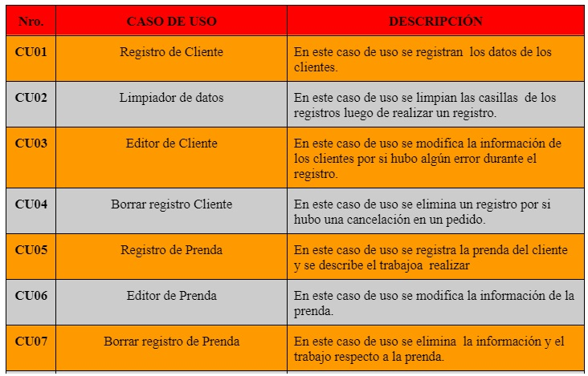

# FACULTAD DE INGENIERÍA Y ARQUITECTURA

## ESCUELA PROFESIONAL DE INGENIERÍA DE SISTEMAS

### IMPLEMENTAR UN SISTEMA DE CONTROL DE ENTRADA Y SALIDA DEL SERVICIO DE COSTURA Y TEÑIDO EN LA EMPRESA "EBENEZER"

                                      INTEGRANTES: 

                  •	Obregon Coronado Pedro Antonio ORCID 0000-0003-2454-0469 100%
                  •	Ampuero Ramos Mirko 		     ORCID 0000-0002-7935-0999 80%
                  •	Bermudez Sevillano Jean 	     ORCID 0000-0001-8333-9277 70%
                  •	Guanilo Otero Angelo                     ORCID 0000-0002-3383-1690 100%
                  •	Mendoza Anamaria Oscar	     ORCID 0000-0001-6115-6138 100%
                  •	Patricio Garcia Juan Carlos             ORCID 0000-0003-4420-1907 70%
                  •	Romo Rubio Brian 		     ORCID 0000-0002-9304-6942  70%

                                      
                                       DOCENTE:

                          Berrocal Navarro Richard Leonardo

                                EXPERIENCIA CURRICULAR
                                Ingeniería de Software

                                        LIMA - PERÚ

                                            2022

# INTRODUCCIÓN 

 Hoy en día sabemos que la tecnología está avanzando de una forma muy rápida y existe la necesidad de ser competitivos en el mercado, es por ello que las organizaciones han dejado de lado aquellos pensamientos antiguos.
El emprendimiento y la innovación son actividades de gran importancia puesto que generan un impacto significativo a nivel social y en el crecimiento económico del país, lo que ha llevado a generar en las personas la necesidad de cambiar el rol de empleados a empleadores con el fin de lograr independencia y estabilidad económica, iniciando sus propios negocios donde se requiere optimizar los recursos financieros, con la finalidad de alcanzar las metas propuestas.

Es el caso de el negocio “EBENEZER” donde el administrador debe de optar de una manera muy acertada invertir para un desarrollo de Sistemas de Información, donde 
esto le permitirá adquirir toda la información que ella requiera y solucionar aquellos problemas que van en contra de la  visión del negocio. Y ante ello con el Sistema de  Información se busca alcanzar beneficios competitivos y  económicos, lo cual esto permitirá que el negocio “EBENEZER” sea distinta a las demás ya que  estará a un paso más adelante con un manejo firme en toma de decisiones con información fiable y en tiempo real.

# ÍNDICE

1. ASPECTOS DE LA ORGANIZACIÓN

   1.1  VISIÓN

    Ser una empresa altamente competitiva en la industria de confección de prendas de vestir. Atendiendo a los distintos tipos de segmentos del mercado.

   1.2. MISIÓN

    Ofrecer a nuestros clientes  un buen trabajo de la mejor calidad en cuanto a prendas de                     vestir, procesándolas con la maquinaria adecuada y con la mejor tecnología.

   1.3 OBJETIVOS
   
       1.3.1 Objetivo General
       *   Diseñar un Plan de sistema de control de entradas y salidas del servicio de costura ,confección y   teñido de prendas de vestir “EBENEZER"
       *   Diseño de un Registro de Datos 

       1.3.2 Objetivos Específicos
       * Controlar las entradas y salidas de los productos en el negocio EBENEZER
       * Conocer mediante un reporte ganancias generadas por dia en el negocio EBENEZER
  

   1.4 ANTECEDENTES

     Actualmente el objetivo del control de entradas y salidas del negocio es reflejar las fluctuaciones de inventario con la máxima precisión. Gracias a ello, es posible conocer a fondo los flujos de mercancías y evaluar si el diseño y el funcionamiento de la instalación está respondiendo con eficacia.  Calle A y Almache R (2013) en su tesis titulada "Implementación de un Sistema de Gestión de la Calidad para una empresa textil." Desarrollan un Sistema de Gestión de la Calidad, basado en los requisitos en la industria textil KATTYSPORT ubicada en el cantón Antonio Ante. Para eso se hizo un diagnóstico situacional comparativo con la regla, para revisar el nivel de cumplimiento, se interpretó los resultados y se armó la iniciativa del sistema de administración de la calidad, que cuenta con la organización estratégica, el mapeo de procesos, la explicación de los mismos, el manual de calidad y al final un cronograma de utilización de puesta en marcha. Obteniendo como consecuencia toda la documentación primordial para la utilización y el enfoque por procesos que asegura la calidad de las prendas confeccionadas a lo largo de todo el proceso de construcción, así como la optimización continua en todos sus procesos con la adecuada administración de todos los recursos usando estandartes de todo el mundo de calidad que la hagan más competitiva en el mercado de hoy

   1.5 ORGANIGRAMA

   

   1.6. ÁMBITO DEL PROYECTO 

	   1.6.1. Área (donde se va a aplicar el Proyecto )
       Este software está dirigido para la eficacia y el buen control de la empresa para tener un un mayor control en el sistema de control de entradas y salidas del servicio
       
       1.6.2. Recursos Humanos (Necesarios para el Proyecto)

| CARGO | NOMBRE | FUNCIONES |
|------------------|:-------------------------------:|-----------:|
| Jefe de proyectos| Mendoza Anamaria Óscar Daniel | Generar facilidad en elnegocio. Garantizar que el proyecto cumple los estándares de calidad esperados
|  Analisis de sistema|  PATRICIO GARCIA, JUAN CARLOS| Diseñar el sistema  que cumpla con las expectativas y la eficacia de la empresa textil .
|                     | AMPUERO RAMOS MIRKO ROMAN    | Realizar un estudio detallado de la empresa, para identificar sus procedimientos y las necesidades de las personas que utilizan sus sistemas.
|                      |BERMUDEZ SEVILLANO JEAN WENIGER, GUANILO OTERO ANGELO  
| Programador          | OBREGON CORONADO PEDRO, ROMO RUBIO BRIAN| Desarrollar aplicaciones y programas informáticos, sirviéndose de las bases de un software existente para crear una interfaz para la empresa|

        1.6.3  Software
        El servicio web contará con los siguientes requisitos:

        * GitHub
        * Enterprise Architect
        * Microsoft Word
        * MySQL
        * Visual Studio Code
        * Microsoft Excel
        * Netbeans

        1.6.4 Hardware
        * AMD Ryzen 5 2400g wiht Radeon Vega Graphics (3.6 ghz) 
        * 8 GB de RAM.

        1.6.5  Cronograma de Actividades

1. ASPECTOS DEL NEGOCIO

   2.1 PROBLEMÁTICA ACTUAL ó ANÁLISIS SITUACIONAL

   El problema principal que se ve en el negocio  “EBENEZER” es que no cuenta con un registro de control de entradas y salidas del servicio de costura, confección y teñido de prendas de vestir; lo cual causa una gran demanda en ciertos procesos y actividades relacionadas al negocio. Pues como todo negocio, demanda que sea rentable y exitoso. Al no tener este proceso automatizado, no solo afecta en el sobretiempo de los trabajadores y la pérdida de ingresos para el negocio, sino también la calidad de la prenda que se le devolverá al cliente.

2. METODOLOGÍA

   3.1. Modelo de Requerimientos.

	   3.1.1.   Cuadro de requerimientos funcionales, indicando: identificativo, nombre y descripción.

      3.1.2 Cuadro de requerimientos no funcionales, indicando: identificativo, nombre y descripción.

     
   

      3.1.3.   Relación de actores y su descripción, cuadro indicando

      3.1.4.   Relación de casos de uso, cuadro indicando:

  
  

      3.1.5 Modelo de Casos de Uso de Requerimientos.

    

      3.1.6.   Plantilla de especificación de casos de uso.
                 
  

  

      3.1.7.   Matriz de trazabilidad de los requerimientos y casos de uso.

      3.1.8. Modelo Conceptual de Clases.

  
      3.1.7.   Matriz de trazabilidad de los requerimientos y casos de uso
   
   
      3.1.8. Modelo Conceptual de Clases

3.2. Análisis Orientado a Objetos

      3.2.1. Modelo de Análisis
      
      
      3.3.1.1. Diagrama de Análisis de Clases
